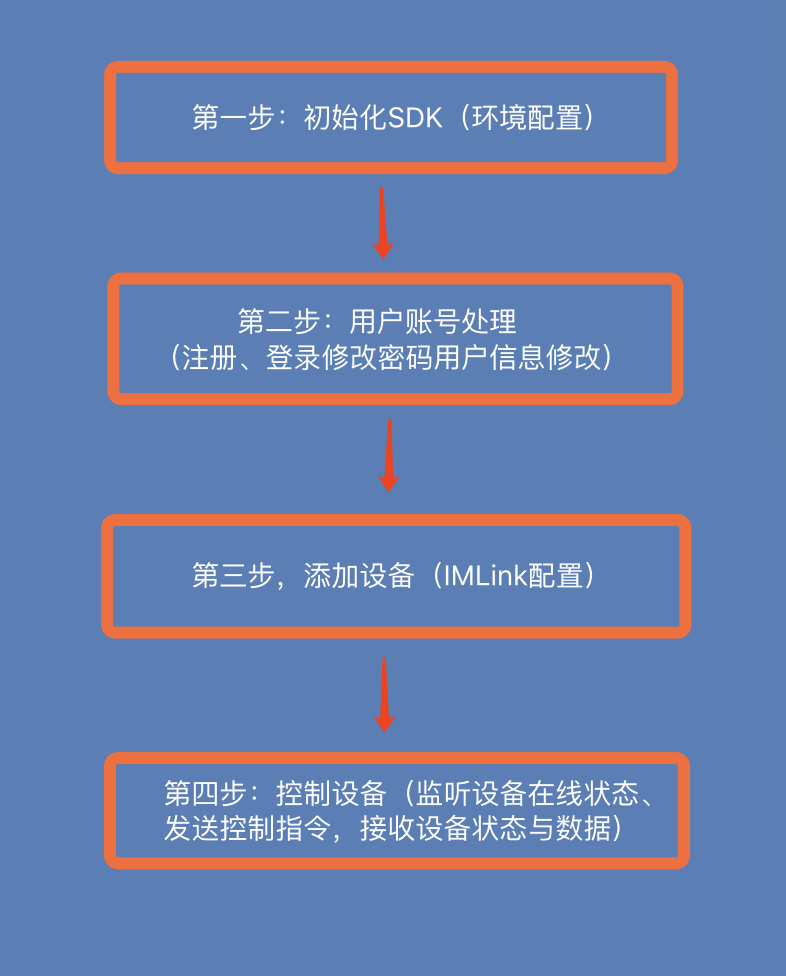

# IntoRobotSDK
## 摩仑科技有限公司
## IntoRobotSDK for iOS

# iOS 开发指南
## 1.概述
### 1.1 IntoRobot接入方案概况
- IntoRobot设备接入SDK（以下简称SDK）封装了手机与IntoRobot硬件设备的通讯协议，以及手机与IntoRobot云平台的通讯协议。这些协议包括配置入网，连接，设备状态监听，心跳等。使用SDK使得开发者能够快速完成App开发，开发者可以更加专注于界面的开发，提升App的用户体验。

### 1.2 SDK功能模块
- HTTP请求
- MQTT连接
- ImLink设备配置


## 2.开发准备
### 2.1 开发环境
- 最低适配iOS版本为iOS 8.0
- 报错 unrecognized selector sent to class
- 是由于会加载静态库文件中的所有成员，-ObjC就是会加载静态库文件中实现一个类或者分类的所有成员，就是这个参数没有设置的原因。将Other Linker Flags=-ObjC，再重新调试，运行成功

### 2.2 注册IntoRobot开发者帐号
* 在使用IntoRobot服务之前，你需要注册[IntoRobot](http://www.intorobot.com/)帐号或在[IntoRobot开放平台](https://api.intorobot.com)上注册开发者帐号，IntoRobot帐号可直接登录开放平台。

### 2.3 获取App ID
* 登录开放平台后，在应用管理界面添加应用，创建一个App应用，生成一对`App ID`和`App Key`。


### 2.4 下载SDK Demo源码
[IntoRobotSDKDemo](https://github.com/IntoRobot/IntoRobotSDK)


## 3.SDK流程简介

### 3.1 SDK集成流程图


### 3.2 配置环境
- 下载IntoRobotSDK，拖入到项目中
- 引用头文件


```objc
#import "IntoRobotSDK.h"
```

- 初始化SDK
	- 使用SDK之前，需要先初始化SDK。
	- 在AppDelegate文件中需要用户指定SDK的App ID和App Key

```objc
[IntoRobotSDKManager setAppID:@"6c25c85f16ae9b033a5a820a40c2a40a"];
[IntoRobotSDKManager setAppKey:@"6a5fe5765329326161085cf0ba9a135f"];
```
- 其中 **appId** 即在开发平台上创建应用时生成的App ID，**appKey**为appId对应的密钥；
- 其中 **setDebug**方法设置是否打印调试信息，默认为false，不打印调试信息。<br>

**集成注意事项**<br>
1、 SDK已经封装了所有的用户、配置、连接、控制的过程，开发者使用这些API可以完成上述流程中的功能开发，不需要再自行实现协议。<br>
2、 SDK接口采用异步处理方式，每个接口采用回调方式将数据传给用户，用户自行处理数据。<br>
3、SDK 用户token失效，需用调用自行处理刷新token。<br>
4、SDK控制设备采用Mqtt协议，相关资料请参阅[Mqtt网站](http://mqtt.org/)。

### 3.3 添加SDK依赖库
- IntoRobotSDK 依赖第三方库文件
	- AFNetworking
	- MQTTClient
	- CocoaAsyncSocket
- 可以根据库管理使用cocoapods或者手动导入

## 4.开发接口
### 4.1 用户部分
**创建用户系统**<br>
用户系统包括用户注册、登录、修改密码、修改个人信息等功能。IntoRobot平台以App ID来区分用户系统，不同的App ID的用户系统相互独立。用户系统在[开放平台](https://api.intorobot.com)上设置。


**绑定用户系统**<br>
创建应用（App）时要求绑定一个用户系统。


**获取App token**<br>
App token用于控制App的访问频率，避免恶意访问。App的其他操作也需要App token有效才能操作。用户启动App访问登录、注册等接口前，需获取App Token。App Token有过期时间，有效期为24小时，过期后需要重新获取访问该接口获取新的App token。<br>
【示例代码】
```objc
   [IntoRobotSDKManager ml_requestAPPToken_GET_Progress:^(NSProgress *downloadProgress) {

    } successBlock:^(id responseObject) {
        //TODO 获取成功

    } errorBlock:^(NSString *errorStr) {
    	//TODO 获取失败

    }];
```

**用户注册**<br>
IntoRobot平台提供手机注册和邮箱注册两种方式。<br>
1、手机注册<br>
第一步：App获取手机短信验证码，SDK向IntoRobot云平台发送获取短信验证码请求，若请求成功则手机会收到短信验证码。<br>
【示例代码】
```objc
        [IntoRobotSDKManager ml_requestSMSCode_POST_WithPhone:@"185****4563" Zone:@"0086" Progress:^(NSProgress *uploadProgress) {

        } successBlock:^(id responseObject) {
            // TODO 请求成功

        } errorBlock:^(NSString *errorStr) {
            // TODO 请求失败

        }];
```

第二步：收到短信验证码后，App将手机短信验证码、手机号码、密码、用户名等信息传给SDK，即可在IntoRobot云平台上注册用户帐号。<br>
【示例代码】
```objc
        /*
        *  @param phone          手机号
        *  @param username       用户名
        *  @param password       密码
        *  @param vldCode        验证码
        */
        NSSting *phone       = @"";
        NSSting *username    = @"";
        NSSting *password    = @"";
        NSSting *vldCode     = @"";
        [IntoRobotSDKManager ml_registerUser_POST_WithPhone:phone username:username password:password vldCode:vldCode Progress:^(NSProgress *uploadProgress) {

        } successBlock:^(id responseObject) {
            // TODO 注册成功
        } errorBlock:^(NSString *errorStr) {
            // TODO 注册失败
        }];
```
2、邮箱注册<br>
第一步： App获取邮箱验证码，ADK向IntoRobot云平台发送获取邮箱验证码请求，若请求成功则邮箱会收到验证码。<br>
【示例代码】
```objc
        [IntoRobotSDKManager ml_requestEmailCode_POST_WithEmail:@"12***78@**.com" Progress:^(NSProgress *uploadProgress) {

        } successBlock:^(id responseObject) {
            // TODO 请求成功
        } errorBlock:^(NSString *errorStr) {
            // TODO 请求失败
        }];
```
第二步：收到邮箱验证码后，App将邮箱验证码、邮箱地址、密码、用户名等信息传给SDK，即可在IntoRobot云平台上注册用户帐号。<br>
【示例代码】
```objc
        NSSting *email       = @"";
        NSSting *username    = @"";
        NSSting *password    = @"";
        NSSting *vldCode     = @"";
        [IntoRobotSDKManager ml_registerUser_POST_WithEmail:email username:username password:password vldCode:vldCode Progress:^(NSProgress *uploadProgress) {

        } successBlock:^(id responseObject) {
            // TODO 注册成功
        } errorBlock:^(NSString *errorStr) {
            // TODO 注册失败
        }];
```

**用户登录**<br>
用户用只能注册过的手机号码、邮箱登录，若App ID更换，则用户系统改变，登录帐号失效，需要重新注册。
【示例代码】
```objc
// 手机号登录
        [IntoRobotSDKManager ml_Login_POST_WithPhone:@"13***09" andPassword:@"***" progress:^(NSProgress *uploadProgress) {

        } successBlock:^(id responseObject) {
            // 登录成功
        } errorBlock:^(NSString *errorStr) {
            // 登录失败
        }];

// 邮箱登录
        [IntoRobotSDKManager ml_Login_POST_WithEmail:@"12***@**.com" andPassword:@"***" progress:^(NSProgress *uploadProgress) {

        } successBlock:^(id responseObject) {
            // 登录成功
        } errorBlock:^(NSString *errorStr) {
            // 登录失败
        }];
```
**重置密码**<br>
用户忘记密码时，可用重置密码接口找回密码。忘记密码需调用获取验证码接口，向服务器发送获取手机验证码或邮箱验证码请求，App得到验证码后发送重置密码接口。
【示例代码】
```objc
// 手机号
        [IntoRobotSDKManager ml_requestSMSCode_POST_WithPhone:@"13******09" Zone:@"0086" Progress:^(NSProgress *uploadProgress) {

        } successBlock:^(id responseObject) {

            [weakSelf codeGetSuccess];

        } errorBlock:^(NSString *errorStr) {
            [MBProgressHUD showError:errorStr];
        }];

// 邮箱账号
        [IntoRobotSDKManager ml_requestEmailCode_POST_WithEmail:@"12***@**.com" Progress:^(NSProgress *uploadProgress) {

        } successBlock:^(id responseObject) {

            [weakSelf codeGetSuccess];

        } errorBlock:^(NSString *errorStr) {
            [MBProgressHUD showError:errorStr];
        }];
```

### 4.2 设备部分
**创建产品**<br>
设备是产品的实例化，产品是在[IntoRobot开放平台](https://api.intorobot.com)上创建的。创建产品及产品化请参考[IntoRobot产品化](http://)。


**配置并创建设备**<br>
产品化后，才能创建可控制都设备。通过手机App创建的设备可以在手机等终端进行控制。App创建设备分为两个步骤：
第一步通过ImLink配置设备连接网络，第二步通过Sdk在IntoRobot云平台创建设备。配置设备需要提供输入设备名称和WiFi密码界面。


确保手机WiFi开启，获取手机当前连接的WiFi SSID和BSSID。<br>
【示例代码】

```objc
    [IntoRobotSDKManager creatDeviceWithDeviceName:@"deviceName" WiFiPwd:@"WiFiPwd" successBlock:^(id responseObject) {
        //创建成功
    } errorBlock:^(NSString *errorStr) {
        //创建失败
    }];
```

**获取设备列表**<br>
创建设备后，用户可在设备列表界面查看该帐号下创建的所有设备。<br>
【示例代码】
```objc

	[IntoRobotSDKManager ml_requestUserDeviceList_GET_Progress:^(NSProgress *downloadProgress) {

    } successBlock:^(id responseObject) {

        // TODO 获取设备列表成功
    } errorBlock:^(NSString *errorStr) {
        // TODO 获取设备列表失败
    }];
```
**获取设备信息**<br>
获取设备详细信息，用于展示单个设备的具体界面，并且实现设备的控制和数据接收发送。<br>
【示例代码】
```objc
    [IntoRobotAPIManager ml_requestDeviceInfo_GET_WithDeviceId:@"deviceId" Progress:^(NSProgress *downloadProgress) {

    } successBlock:^(id responseObject) {
        // TODO 获取设备详细信息成功
    } errorBlock:^(NSString *errorStr) {
        // TODO 获取失败
    }];
```

**删除设备**<br>
【示例代码】

```objc
    [IntoRobotSDKManager ml_deleteDevice_DELETE_WithDeviceId:@"deviceId" successBlock:^(id responseObject) {
        // TODO 删除设备成功
    } errorBlock:^(NSString *errorStr) {
        // TODO 删除设备失败
    }];
```
**创建Mqtt连接**<br>
在发布指令或接收消息之前，必须先创建[Mqtt](http://mqtt.org/)连接。建立Mqtt连接需要帐号和密码，其中帐号（mqttUser）是用户登录时IntoRobot平台返回的token，而密码则是返回的userId。<br>
【示例代码】
```objc
// 引入事实订阅头文件
    #import "IntoRobotMQTTManager.h"
// 连接上订阅消息
    IntoRobotMQTTManager *mqttManager = [IntoRobotMQTTManager shareIntoRobotMQTTManager];
    mqttManager.ml_MQTTDelegate = self;
    [mqttManager ml_MqttConnectWithUser:@"usertoken" pass:@"userId" connectHandle:^(int handEnumValue) {
    // 连接回调

    }];
```

**监听设备在线状态**<br>
- 监听设备在线状态是实时推送。获取设备列表后，订阅（subscribe）设备的在线状态。该接口有另个回调方法:`ml_HandleMessage:onTopic:retained:`为接收数据回调，只有当订阅成功了，`ml_HandleMessage:(NSData *)data onTopic:(NSString *)topic retained:`才有效。设备有"**在线**"和"**离线**"两种状态：分别返回payload: "**online**"和"**offline**"。<br>

【示例代码】

```objc
//订阅设备在线状态
    [mqttManager ml_SubDeviceOnlineStatusWithDeviceId:@"deviceId" SubHandle:^(NSDictionary *subscriptions) {
        //TODO 订阅设备在线状态回调
    }];

// 实现代理方法，监听订阅消息回调
- (void)ml_HandleMessage:(NSData *)data onTopic:(NSString *)topic retained:(BOOL)retained{
    // TODO 监听到设备在线状态信息
    NSString *dataString = [[NSString alloc] initWithData:data encoding:NSUTF8StringEncoding];

}
```
### 4.3 设备控制

**发布控制指令**<br>
【示例代码】
```objc
        NSString *boolValue = [NSString stringWithFormat:@"%d",YESorNO];
        NSData *sendData = [boolValue dataUsingEncoding:NSUTF8StringEncoding];
        [self.mqttManager ml_PubDeviceStatusWithData:sendData DeviceId:@"deviceId" sensorsDic:sensorDic];

// 代理方法发布成功回调
- (void)ml_MessageDelivered:(UInt16)msgID
{
    // gets called when a published message was
    // actually delivered
}
```
**接收数据**<br>
【示例代码】
```objc
[mqttManager ml_SubDeviceStatusWithDeviceId:@"deviceId" sensorsDic:sensor SubHandle:^(NSDictionary *subscriptions) {
    // TODO 订阅成功回调
    }];
```
**取消订阅（不接收数据）**<br>
【示例代码】
```objc
[mqttManager ml_UnSubScribeTopic:@"topic" unSubHandle::^(NSDictionary *subscriptions) {
    // TODO 取消订阅回调
    }];
```

**断开连接**<br>
【示例代码】
手动断开连接，将取消所有订阅消息，不在接收数据和发送指令。
```objc
[mqttManager disconnect];
```
## 5 返回码说明

| 返回码                |   说明                | 返回码                |   说明                | 返回码                |   说明                | 返回码                |   说明                |
|-----------------------|:---------------------:|-----------------------|:---------------------:|-----------------------|:---------------------:|-----------------------|:---------------------:|-
|   50101               |   系统错误			|   40001               |   错误调用			    |   40114               |   激活码过期			    |   41210               |   设备需要解锁		    |
|   50102               |   系统错误			|   40002               |   参数错误			    |   40115               |   账户已被冻结	    	|   41211               |   设备需要解锁		    |
|   50103               |   系统错误			|   40003               |   不允许			    |   40116               |   请求sms vldCode太频繁  |   41212               |   数量限制			    |
|   50104               |   系统错误			|   40004               |   资源不存在			|   40117               |   注册太频繁			    |   41213               |   未知型号			    |
|   50105               |   系统错误			|   40005               |   数据错误			    |   40118               |   忘记密码太频繁		    |   41214               |   缺少phyDeviceId		|
|   50106               |   系统错误			|   40006               |   uid不匹配			    |   40152               |   需要重登陆			    |   1100                |   Imlink建立失败		    |
|   50201               |   系统错误			|   40007               |   device id不匹配		|   40154               |   需要刷新token		    |   1101                |   获取WiFi IP地址失败	|
|   50202               |   系统错误			|   40008               |   id不合法			    |   40153               |   缺少refreshToken	    |   1102                |   接收数据解析错误	    |
|   50203               |   系统错误			|   40009               |   缺少id			    |   40301               |   字段类型错误		    |   1103                |   UDP接收数据失败		|
|   50204               |   系统错误			|   40010               |   缺少vrfID			    |   40302               |   数量限制			    |   1104                |   socket连接错误		    |
|   50205               |   系统错误			|   40011               |   验证码错误			|   40303               |   用户系统被引用		    |   1105                |   发送数据，未知主机	    |
|   50206               |   系统错误			|   40012               |   content type错误	    |   40304               |   用户系统不存在		    |   1106                |   UDP发送数据失败		|
|   50207               |   系统错误			|   40013               |   size错误			    |   40401               |   没有权限			    |   1107                |   发送数据解析错误	    |
|   50208               |   系统错误			|   40014               |   间隔错误			    |   40402               |   数量限制			    |   1108                |   设备握手响应超时	    |
|   50209               |   系统错误			|   40015               |   缓存过期			    |   40403               |   App被引用			    |   1109                |   设备设置平台信息超时   |
|   50301               |   系统错误			|   40016               |   验证码过期			|   40404               |   App不存在			    |   1110                |   设备不可用			    |
|   50302               |   系统错误			|   40017               |   已经存在			    |   40405               |   没有appToken		    |   1111                |   创建设备超时		    |
|   50303               |   系统错误			|   40018               |   名称重复			    |   40406               |   token过期			    |   1200                |   创建设备成功		    |
|   50304               |   系统错误			|   40020               |   请重试			    |   40502               |   数量限制			    |   -100                |   网络错误               |
|   50305               |   系统错误			|   40021               |   请求太频繁			|   40503               |   字段类型错误		    |
|   50306               |   系统错误			|   40022               |   name不合法			|   40504               |   产品不存在			    |
|   50307               |   系统错误			|   40023               |   zone不合法			|   40505               |   已经在申请流程中  	    |
|   50308               |   系统错误			|   40024               |   sms数量限制			|   40506               |   不在申请流程中		    |
|   50309               |   系统错误			|   40025               |   签名错误			    |   40602               |   数量限制			    |
|   50310               |   系统错误			|   40026               |   Header错误			|   40603               |   字段类型错误		    |
|   50311               |   系统错误			|   40027               |   上传内容缺失		    |   40604               |   解决方案不存在		    |
|   50312               |   系统错误			|   40101               |   用户未注册			|   41001               |   appid不匹配			|
|   50313               |   系统错误			|   40102               |   用户未激活			|   41101               |   时间戳太旧			    |
|   50314               |   系统错误			|   40103               |   密码错误			    |   41102               |   Auth字段不正确		    |
|   50315               |   系统错误			|   40104               |   缺少stateID			|   41104               |   token不存在			|
|   50316               |   系统错误			|   40105               |   state码错误			|   41201               |   device坐标参数错误	    |
|   50317               |   系统错误			|   40106               |   openid已绑定		    |   41202               |   device纬度参数错误	    |
|   50318               |   系统错误			|   40107               |   帐号已绑定			|   41203               |   device经度参数错误	    |
|   50319               |   系统错误			|   40108               |   用户名已存在		    |   41204               |   设备id已注册		    |
|   50320               |   系统错误			|   40109               |   邮箱已注册			|   41205               |   设备id未注册		    |
|   50321               |   系统错误			|   40110               |   手机号已注册		    |   41206               |   设备id不合法		    |
|   50322               |   系统错误			|   40111               |   需要重登陆			|   41207               |   设备需要在线		    |
|   50323               |   系统错误			|   40112               |   用户名不合法		    |   41208               |   不是设备拥有者		    |
|   50324               |   系统错误			|   40113               |   已关注该用户		    |   41209               |   正在更新token		    |

